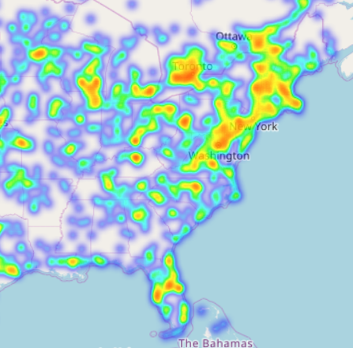

This repo is for directly comparing various Python libraries for data visualization, as well as a discussion of their strengths and weaknesses.

Dependencies:
* Anaconda (Python 3)
* Basemap

[Heat maps with Folium.](http://nbviewer.jupyter.org/github/dovinmu/python-viz-notebooks/blob/master/heatmaps_folium.ipynb) Making an interactive heat map of all the coffee shops in the United States. Data gathered from Open Street Map.

[Choropleths with Geopandas and Folium.](http://nbviewer.jupyter.org/github/dovinmu/python-viz-notebooks/blob/master/choropleths.ipynb) Mapping Internet usage by country.

For the libraries that output Javascript (Folium, Bokeh, Altair, sometimes Plotly), I link the [Notebook Viewer](http://nbviewer.jupyter.org/github/dovinmu/python-viz-notebooks/tree/master/) page for this repository.

Tools exploring:
  * Matplotlib
  * pandas
  * Bokeh
  * Seaborn
  * Basemap

Not yet explored:
  * datashader
  * Plot.ly
  * holoviews
  * Altair
