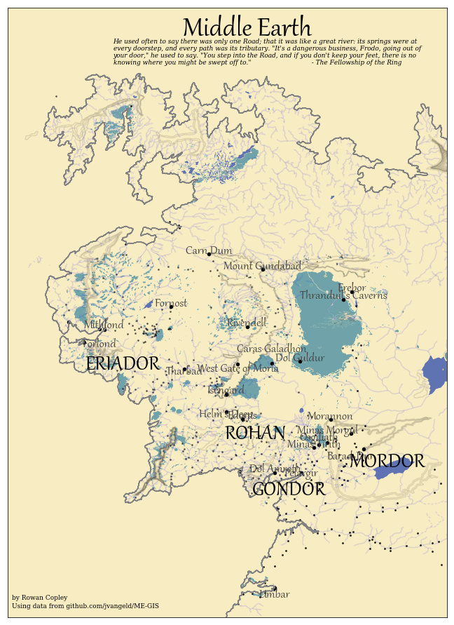

This repository is for comparing Python libraries for data visualization, exploring what's possible, and discussing their strengths and weaknesses.

[Heat maps with Folium.](http://nbviewer.jupyter.org/github/dovinmu/python-viz-notebooks/blob/master/heatmaps_folium.ipynb) Making an interactive heat map of all the coffee shops in the United States. Data gathered from Open Street Map.

[Bar charts comparison.](https://nbviewer.jupyter.org/github/dovinmu/python-viz-notebooks/blob/master/bar_charts.ipynb) How easy is it to make a humble bar chart using different Python visualization modules?

[Choropleths with Geopandas and Folium.](http://nbviewer.jupyter.org/github/dovinmu/python-viz-notebooks/blob/master/choropleths.ipynb) Mapping Internet usage by country.

[Geographic projection comparison.](http://nbviewer.jupyter.org/github/dovinmu/python-viz-notebooks/blob/master/map_projections.ipynb) How easy is it to make a map projection with different Python spatial-aware modules?

[Styling maps with Geopandas and matplotlib.](https://nbviewer.jupyter.org/github/dovinmu/python-viz-notebooks/blob/master/stylized_fantasy_maps.ipynb) Making a fantasy-style map of Middle Earth.

For the libraries that output Javascript (Folium, Bokeh, Altair, sometimes Plotly), I link the [Notebook Viewer](http://nbviewer.jupyter.org/github/dovinmu/python-viz-notebooks/tree/master/) page for this repository.

Dependencies:
* Anaconda (Python 3)
* Basemap
* GeoPandas
